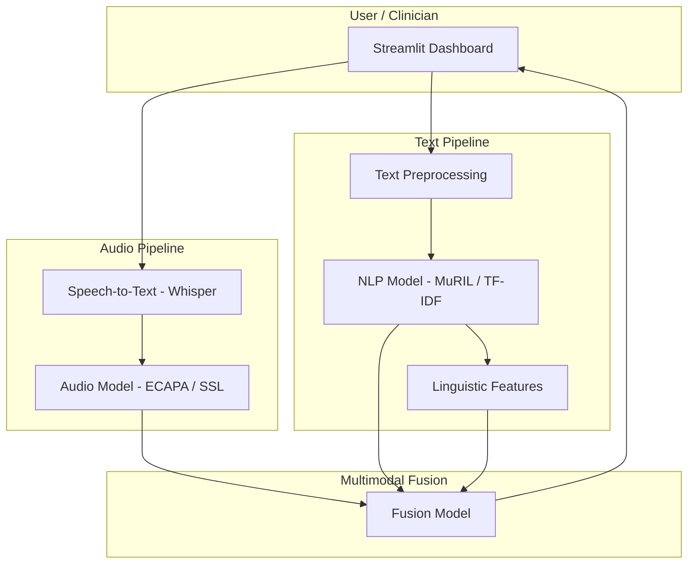

<div align="center">

# Multimodal Depression Detection System

### Real-Time Depression Risk Assessment in Dravidian Languages

AI-powered clinical decision support system for depression detection using multimodal analysis (speech, text, and linguistic features)

[](https://github.com/S6-Project-Workspace/depression-detection-from-speech)
[](LICENSE)
[](https://python.org)
[](https://streamlit.io)
[](https://docker.com)

[About](#about-the-project) | [Architecture](#system-architecture) | [Features](#key-features) | [Getting Started](#getting-started) | [Tech Stack](#tech-stack) | [Team](#team)

</div>

---

## About the Project

This project is a production-ready system for real-time depression risk assessment in Tamil and Malayalam, combining:
- Speech analysis (audio models)
- Text analysis (NLP models)
- Linguistic feature extraction
- Multimodal fusion for robust predictions

### The Problem: Depression Detection in India

Depression is a major public health challenge, especially in regional languages. Existing tools lack multimodal support and real-time feedback for clinicians and users.

### Our Solution

- Real-time risk prediction (sub-2s latency)
- Multimodal fusion (audio, text, linguistic)
- Clinical dashboard for healthcare providers
- Multi-language support (Tamil, Malayalam)
- Privacy-first design (DPDP Act 2023 compliance)

---

## System Architecture

The system uses a modular architecture with separate pipelines for audio, text, and fusion models. A Streamlit dashboard provides real-time feedback and visualization.



### Component Flow

1. **Audio Input**: User records or uploads speech
2. **ASR**: Whisper transcribes audio to text
3. **Text Analysis**: NLP models process text
4. **Linguistic Analysis**: POS, NER, dependency parsing
5. **Fusion**: All features combined for final prediction
6. **Dashboard**: Results visualized for user/clinician

---

## Key Features

### Real-Time Multimodal Prediction
- Sub-2s latency for end-to-end prediction
- Audio, text, and linguistic features fused
- Streamlit dashboard for live feedback

### Audio Analysis
- ECAPA-TDNN and SSL models for speech
- Whisper for robust ASR
- Speaker diarization and confidence scoring

### Text & Linguistic Analysis
- MuRIL transformer and TF-IDF baseline
- POS tagging, NER, dependency parsing
- Language support: Tamil, Malayalam

### Fusion Engine
- Weighted score combination
- Handles missing modalities
- Explainable predictions

### Security & Compliance
- DPDP Act 2023 compliance
- Data privacy and user consent

---

## Tech Stack

- Python 3.12
- Streamlit 1.30+
- PyTorch, Transformers
- OpenAI Whisper
- MuRIL, TF-IDF
- Docker (optional)

---

## Getting Started

### Prerequisites
- Python 3.12+
- Streamlit
- Docker (optional)

### Quick Start

```bash
# 1. Clone the repository
git clone https://github.com/S6-Project-Workspace/depression-detection-from-speech.git
cd depression-detection-from-speech

# 2. Install dependencies
pip install -r requirements.txt

# 3. Run the Streamlit dashboard
streamlit run test_all_models.py
```

---

## Project Structure

```
NLP/
├── app.py
├── streamlit_app.py
├── test_all_models.py
├── requirements.txt
├── audio models, text models, fusion models
├── web_interface/
├── tests/
└── ...
```

---

## Configuration

Configuration is managed via `config.py` and environment variables. See `requirements.txt` for dependencies.

---

## Testing

```bash
pytest tests/ -v
```

---

## Deployment

Docker support is available for backend services. See `docker-compose.yml` if present.


---

## License

This project is licensed under the MIT License. See the [LICENSE](LICENSE) file for details.

---

## Contact

- GitHub Issues: [Report Bug](https://github.com/S6-Project-Workspace/depression-detection-from-speech/issues) | [Request Feature](https://github.com/S6-Project-Workspace/depression-detection-from-speech/issues)

<div align="center">

Multimodal Depression Detection for Dravidian Languages


[Star us on GitHub](https://github.com/S6-Project-Workspace/depression-detection-from-speech) | [Report Issues](https://github.com/S6-Project-Workspace/depression-detection-from-speech/issues)

</div>
